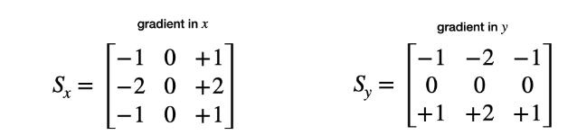

## camera
### smoothing
Gaussian filtering factor: kernal size and standard deviation.

### detector
1) Sobel Detector
compute intensity gradient of images either in x or in y direction.

2) Harris Detector
Harris Detector is the most famous corner detector.
intensity change can be described by sum of squred intensity difference, which related to the covariance matrix. covariance matrix can be visualized as  an ellipse, large axis represents high gradient, and low axis represents low gradient. Harris Detector uses a Gaussian window to get a weighted sum of intensity gradient. By adjusting the window the POI can be controlled.

3) FAST(Features from Accelerated Segments Test) Detector

### Descriptor
Descriptors help us to assign similar keypoints in different images to each other
1) SIFT Descriptor
A representative of gradient-based descriptors, belongs to HOG family.
2) BRISK
A representative of binary descriptors
3) ORB
Fast detector + BRIEF Descriptor
4) BRIEF(Binary Robust Independent Elementary Features)

### Descriptor matching
1) brute force matching
 For a given keypoint from the first image, it takes every keypoint in the second image and calculates the distance. The keypoint with the smallest distance will be considered its pair.
2) KD tree

