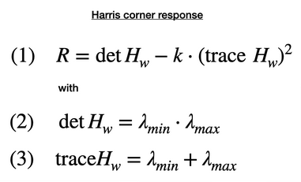

## camera
### smoothing
Gaussian filtering factor: kernal size and standard deviation.

### detector
1) Sobel Detector
compute intensity gradient of images either in x or in y direction
2) Harris Detector
intensity change can be described by sum of squred intensity difference, which related to the covariance matrix. covariance matrix can be visualized as  an ellipse, large axis represents high gradient, and low axis represents low gradient. Harris Detector uses a Gaussian window to get a weighted sum of intensity gradient. By adjusting the window the POI can be controlled.

3) SIFT Detector

